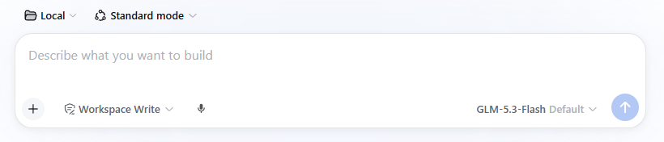
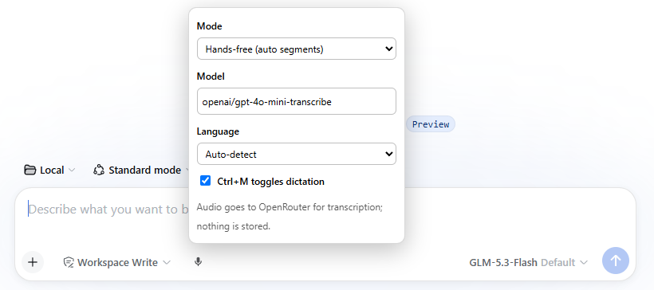

# dsh-plugin-dictate

Live speech-to-text dictation for the [DeepSeek Harness](https://github.com/deepseek-ai/deepseek-harness) **web UI**. Click the microphone button in the composer tool row, speak, and your words appear in the prompt as you talk — mixable with normal typing, at your cursor, without touching what you already wrote.



Transcription runs on **OpenRouter's STT endpoint** (`/api/v1/audio/transcriptions`). The API key stays server-side: the browser only POSTs audio segments to a local route this plugin registers inside dsh.

## Install

Requires dsh ≥ 0.1.1-rc.1 and a running `dsh web` profile.

```sh
# from npm
dsh plugin --profile web add dsh-plugin-dictate

# or straight from this repo
dsh plugin --profile web add https://github.com/navneetset/dsh-dictate.git

# or a local checkout (link: — edits + rebuild show up on next restart)
dsh plugin --profile web add /path/to/dsh-dictate
```

`dsh plugin add` installs the package into the profile and appends it to the profile's bundle list, so **one command activates both halves** (host route + browser mic button). If pnpm complains about the workspace root (first-time setup on some profiles), add `-w` right after `add`. Restart `dsh web` and reload the page. Updating later: re-run the same `add` command to resolve the latest version.



## Features

- **Hands-free mode** — tap the mic and talk continuously. Segments are cut on natural pauses (voice-activity detection) and inserted with ~1–2s lag; long continuous speech is force-split well before the 60s upstream ceiling.
- **Push-to-talk mode** — hold the mic button, release to transcribe. Better in noisy rooms.
- **Ctrl+M** toggles dictation (configurable off in settings).
- **Right-click the mic** for settings: mode, STT model, dictation language, hotkey. Stored per browser in `localStorage`, sent per request — nothing else to configure.
- **Default model**: `openai/gpt-4o-mini-transcribe` (cheap, fast). Also good: `openai/gpt-4o-transcribe` (best accuracy), `openai/whisper-large-v3` (strongest multilingual, notably Dutch).
- `/dictate` slash command prints a status/usage summary.

## API key

The host half proxies transcription to OpenRouter and needs one of:

1. **`OPENROUTER_API_KEY`** environment variable (preferred — visible to the dsh process), or
2. A plain value in the profile patch (`~/.dsh/profiles/web/cordis.patch.yml`):

   ```yaml
   - id: dictate
     config:
       apiKey: sk-or-v1-...
   ```

The env var wins when both are set. Without either, the mic button reports `Missing OpenRouter API key` on first use.

## Config reference (host row config)

| Key | Default | Meaning |
|---|---|---|
| `apiKeyEnv` | `OPENROUTER_API_KEY` | Env var name holding the OpenRouter key |
| `apiKey` | — | Plain-value key fallback (env var preferred) |
| `endpoint` | `https://openrouter.ai/api/v1/audio/transcriptions` | STT endpoint |
| `routePath` | `/dictate/transcribe` | Local POST route the browser calls |
| `maxAudioBytes` | `25000000` | Segment size cap (matches OpenRouter's limit) |

## Privacy & security notes

- Audio is captured **only while the button is active** (recording or push-to-talk held); segments are transcribed in-memory and never written to disk.
- Every segment is sent to **OpenRouter** (a third party) for transcription — that's the point of the plugin; don't dictate secrets you wouldn't put through your LLM provider.
- The OpenRouter key never reaches the browser.
- This route is unauthenticated like the rest of the dsh webserver — if you bind dsh to your LAN, anyone on it can also reach this route (and transcribe on your OpenRouter account). Keep the firewall rule tight.

## Troubleshooting

- **No mic button** — the plugin must be in the profile's bundle list (`dsh --profile web --dump-config | grep dictate`) and dsh restarted; the page reloaded. Check the browser console for `[dsh-dictate]` warnings.
- **`Missing OpenRouter API key`** — set the env var or config value above, restart dsh web.
- **`Microphone permission denied`** — allow mic access for the page (browser address bar → site settings).
- **Wrong language / garbled text** — set Language in the mic settings; auto-detect needs a clear first sentence.
- **Text lands in the wrong spot** — insertion goes to the composer's current draft end; dictation and typing interleave best by speaking first, then editing.
- **Debug** — `window.__dshDictate` in the browser console: `.state` (controller phase), `.prefs` (active settings), and `.inserter('text')` to test insertion without the mic.

## Scope / limitations

- **Web UI only** (`dsh web`). The terminal (TUI) surface has no client-plugin slots for this; not supported.
- OpenRouter's transcription endpoint is not streaming: text arrives in segment-sized chunks (~1–2s behind speech), not word-by-word.
- No TUI, no audio history, no voice commands — it types into the prompt, that's all.

## Developing

```sh
npm install
npm run build   # builds lib/index.js (host) + dist/client.js (browser)
```

The profile install is a pnpm `link:` to this repo when installed from a local path — rebuild here, restart `dsh web`, reload the page. The client bundle is a `window.__ModuleLoader__.load({ id, factory })` envelope whose module exports `inject`/`apply` (a Cordis client plugin); the host module exports the standard Cordis `name`/`inject`/`Config`/`apply`.

## License

MIT
